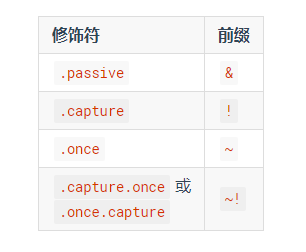
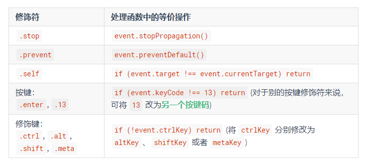

# Vue教程阅读笔记

## 一、基础

### Vue实例

1.数据与方法

 - 当一个 Vue 实例被创建时，它向 Vue 的响应式系统中加入了其 data 对象中能找到的所有的属性。当这些属性的值发生改变时，视图将会产生“响应”，即匹配更新为新的值。
 - 只有当vue实例被创建时，data中存在的属性才是响应式的。向实例中添加新的属性并作出改动不会触发任何视图的更新。
 - 唯一的例外是使用 Object.freeze()会阻止修改现有的属性，也意味着响应系统无法再追踪变化
 - 除了数据属性，还有一些前缀$的实例属性与方法，以便与用户定义的属性区分开来。

2.实力生命周期钩子

 - 不要在选项属性或回调上使用箭头函数，因为箭头函数的this指向父级上下文，而不是当前vue实例。

3.生命周期图示

### 模板语法

1.插值

2.指令

 - 动态参数，方括号中的内容会作为一个JavaScript表达式进行动态求值。
 - 注意：动态属性的值为null时会显性移除绑定，动态表达式中不能使用空格和引号，建议使用计算属性代替复杂表达式。
 - 修饰符（modifier）

     <a v-bind:[attributeName]="url"> ... </a>
     //如果你的 Vue 实例有一个 data 属性 attributeName，其值为 "href"，那么这个绑定将等价于 v-bind:href

     <a v-on:[eventName]="doSomething"> ... </a>
     //当 eventName 的值为 "focus" 时，v-on:[eventName] 将等价于 v-on:focus

3.缩写

### 计算属性和侦听器

1.计算属性缓存 VS 方法   

 - **相同点：**将同一个函数定义为一个方法或计算属性其结果是相同的
 - **不同点：**计算属性是基于它们的依赖进行缓存的，只有在相关依赖发生改变时他们才会重新求值（缓存）；
              只要data不发生改变，多次访问计算属性会立即返回之前的计算结果，而不必再次执行计算。   
              相比之下，每当重新触发渲染时，调用方法将**总会**再次执行函数。

2.计算属性 VS 侦听属性

3.计算属性的setter

 - 计算属性默认只有getter，不过在需要时你也可以提供一个setter。

        // ...
        computed: {
          fullName: {
            // getter
            get: function () {
              return this.firstName + ' ' + this.lastName
            },
            // setter
            set: function (newValue) {
              var names = newValue.split(' ')
              this.firstName = names[0]
              this.lastName = names[names.length - 1]
            }
          }
        }
        // ...

4.侦听器

当需要在数据变化时执行异步或开销较大的操作时，这个方式是最有用的。

### Class与Style绑定

1.对象语法

        

        data: {
          isActive: true,
          error: null
        },
        computed: {
          classObject: function () {
            return {
              active: this.isActive && !this.error,
              'text-danger': this.error && this.error.type === 'fatal'
            }
          }
        }

2.数组语法

        

        data: {
          activeClass: 'active',
          errorClass: 'text-danger'
        }

        

3.用在组件上

当在一个自定义的组件使用class属性时，这些类将被添加到该组件的根元素上，这个元素上已经存在的类不会被覆盖。

### 条件渲染

1.<template>可以当做不可见的包裹元素，在该元素上使用v-if指令可以条件渲染一组内容

        <template v-if="ok">
          <h1>Title</h1>
          
Paragraph 1

          
Paragraph 2

        </template>

2.Vue 会尽可能高效地渲染元素，通常会复用已有元素而不是从头开始渲染。这么做除了使 Vue 变得非常快之外，还有其它一些好处。

        <template v-if="loginType === 'username'">
          <label>Username</label>
          <input placeholder="Enter your username">
        </template>
        <template v-else>
          <label>Email</label>
          <input placeholder="Enter your email address">
        </template>

那么在上面的代码中切换 loginType 将不会清除用户已经输入的内容。因为两个模板使用了相同的元素，<input> 不会被替换掉——仅仅是替换了它的 placeholder。

但是在实际需求中，如果需要表达“这两个元素是完全独立的，不要复用它们”，只需要添加具有唯一值的key属性即可。

3.注意：v-show指令不支持<template>元素，也不支持v-else。

4.v-if VS v-show  

 - v-if是“真正”的条件渲染，因为它会确保在切换过程中条件块内的事件监听器和子组件适当的被销毁和重建。
 - v-if也是惰性的：如果在初始渲染时条件为假，则什么也不做直到条件第一次变为真时，才会开始渲染条件块。
 - v-show不论初始条件是什么，元素总是会被渲染，并且只是简单的基于css进行切换。

一般来说，v-if具有更高的切换开销，而v-show有更高的初始渲染开销。因此：

 - 如果需要频繁切换，使用v-show较好；
 - 如果在运行时条件很少改变，则使用v-if较好。

5.不推荐同时使用v-for和v-if，但是当它们一起使用时，v-for优先级更高

### 列表渲染

1.遍历数组和对象属性

        

        

        

          {{ index }}. {{ key }}: {{ value }}
        

> 在遍历对象时，是按 Object.keys() 的结果遍历，但是不能保证它的结果在不同的 JavaScript 引擎下是一致的。

2.“就地复用”策略

当 Vue.js 用 v-for 正在更新已渲染过的元素列表时，它默认用“就地复用”策略。
如果数据项的顺序被改变，Vue 将不会移动 DOM 元素来匹配数据项的顺序， 而是简单复用此处每个元素，并且确保它在特定索引下显示已被渲染过的每个元素。

因此建议在使用v-for时提供key属性，除非遍历输出的DOM内容非常简单，或者是刻意依赖默认行为以获取性能上的提升。

3.数组的方法

变异方法（mutation method）会改变被这些方法调用的原始数组

 - push()            // 末尾添加一个或多个元素,返回新的长度
 - pop()             // 删除并返回数组的最后一个元素
 - shift()           // 删除并返回数组的第一个元素
 - unshift()         // 开头添加一个或更多元素,并返回新的长度
 - **splice()**      // 向/从数组中添加/删除项目,然后返回被删除的项目
 - sort()            // 默认是升序排序,如果想按照其他标准进行排序,就需要提供比较函数
 - reverse()         // 颠倒数组中元素的顺序

非变异方法（non-mutating method）不会改变原始数组，总是返回一个新数组。

 - filter()          // 返回通过过滤的元素数组
 - concat()          // 连接两个或多个数组
 - slice(start,end)  // 从已有的数组中返回选定的元素

此时用含有相同元素的数组去替换原来的数组是非常高效的操作，Vue不会完全丢弃现有的DOM，并重新渲染整个列表。

        example1.items = example1.items.filter(function (item) {
          return item.message.match(/Foo/)
        })

4.注意事项

 - 由于 JavaScript 的限制，Vue 不能检测以下变动的数组：

   a.当你利用索引直接设置一个项时，例如：vm.items[indexOfItem] = newValue
   b.当你修改数组的长度时，例如：vm.items.length = newLength

        var vm = new Vue({
          data: {
            items: ['a', 'b', 'c']
          }
        })
        vm.items[1] = 'x' // 不是响应性的
        vm.items.length = 2 // 不是响应性的

为解决这样的问题，以下两种方式都可以实现数据更新，并且触发状态更新

        // Vue.set
        Vue.set(vm.items, indexOfItem, newValue)

        // Array.prototype.splice
        vm.items.splice(indexOfItem, 1, newValue)
        vm.items.splice(newLength)

        //你也可以使用 vm.$set 实例方法，该方法是全局方法 Vue.set 的一个别名：
        vm.$set(vm.items, indexOfItem, newValue)

 - 由于 JavaScript 的限制，Vue 不能检测对象属性的添加或删除：
 对于已经创建的实例，Vue 不能动态添加根级别的响应式属性。但是，可以使用 Vue.set(object, key, value) 方法向嵌套对象添加响应式属性。

        var vm = new Vue({
          data: {
            userProfile: {
              name: 'Anika'
            }
          }
        })
        Vue.set(vm.userProfile, 'age', 27)
        vm.$set(vm.userProfile, 'age', 27)

 如果需要为已有对象添加多个新属性，比如使用 *Object.assign()* 或 *_.extend()*
 这种情况下应该用新增对象的属性创建一个新的对象，添加新的响应式属性不能这样：

        Object.assign(vm.userProfile, {
            age: 27,
            favoriteColor: 'Vue Green'
        })

 正确的做法是：

        vm.userProfile = Object.assign({}, vm.userProfile, {
            age: 27,
            favoriteColor: 'Vue Green'
        })

5.显示过滤/排序结果

有时，我们想要显示一个数组的过滤或排序副本，而不实际改变或重置原始数据。
在这种情况下，可以创建返回过滤或排序数组的计算属性。

类似于 v-if，你也可以利用带有 v-for 的 <template> 渲染多个元素

### 事件处理

1.事件修饰符

        <!-- 阻止单击事件继续传播 -->
        

        <!-- 提交事件不再重载页面 -->
        <form v-on:submit.prevent="onSubmit"></form>

        <!-- 修饰符可以串联 -->
        

        <!-- 只有修饰符 -->
        <form v-on:submit.prevent></form>

        <!-- 添加事件监听器时使用事件捕获模式 -->
        <!-- 即元素自身触发的事件先在此处理，然后才交由内部元素进行处理 -->
        
...

        <!-- 只当在 event.target 是当前元素自身时触发处理函数 -->
        <!-- 即事件不是从内部元素触发的 -->
        
...

        <!-- 点击事件将只会触发一次 -->
        

        <!-- 滚动事件的默认行为 (即滚动行为) 将会立即触发 -->
        <!-- 而不会等待 `onScroll` 完成  -->
        <!-- 这其中包含 `event.preventDefault()` 的情况 -->
        <!-- .passive 修饰符尤其能够提升移动端的性能 -->
        
...

> 使用修饰符时，顺序很重要；相应的代码会以同样的顺序产生。因此，用 v-on:click.prevent.self 会阻止所有的点击，
而 v-on:click.self.prevent 只会阻止对元素自身的点击。

> 不要把 .passive 和 .prevent 一起使用，因为 .prevent 将会被忽略，同时浏览器可能会向你展示一个警告。
请记住，.passive 会告诉浏览器你不想阻止事件的默认行为。

2.按键修饰符

可以直接将 KeyboardEvent.key 暴露的任意有效按键名转换为 kebab-case 来作为修饰符。

        <!-- 只有在 `key` 是 `Enter` 时调用 `vm.submit()` -->
        <input v-on:keyup.enter="submit">

        <!-- 处理函数只会在 $event.key 等于 PageDown 时被调用 -->
        <input v-on:keyup.page-down="onPageDown">

按键码的用法已经被废弃了，为支持旧浏览器，Vue提供了绝大多数常用的按键码的别名：

 - .enter
 - .tab
 - .delete (捕获“删除”和“退格”键)
 - .esc
 - .space
 - .up
 - .down
 - .left
 - .right

3.可以通过全局*config.keyCodes*对象自定义按键修饰符别名：

        // 可以使用 `v-on:keyup.f1`
        Vue.config.keyCodes.f1 = 112

4.系统修饰键

 - .ctrl

        //只有在按住 ctrl 的情况下释放其它按键，才能触发 keyup.ctrl
        //如果需要单单释放 ctrl，请为 ctrl 换用 keyCode（：keyup.17）

 - .alt
 - .shift
 - .meta
 - .exact

        <!-- .exact 修饰符允许你控制由精确的系统修饰符组合触发的事件 -->
        <!-- 即使 Alt 或 Shift 被一同按下时也会触发 -->
        <button @click.ctrl="onClick">A</button>

        <!-- 有且只有 Ctrl 被按下的时候才触发 -->
        <button @click.ctrl.exact="onCtrlClick">A</button>

        <!-- 没有任何系统修饰符被按下的时候才触发 -->
        <button @click.exact="onClick">A</button>

4.鼠标按钮修饰符

 - .left
 - .right
 - .middle

5.为什么在HTML中监听事件

 a.扫一眼 HTML 模板便能轻松定位在 JavaScript 代码里对应的方法
 b.因为你无须在 JavaScript 里手动绑定事件，你的 ViewModel 代码可以是非常纯粹的逻辑，和 DOM 完全解耦，更易于测试。
 c.当一个 ViewModel 被销毁时，所有的事件处理器都会自动被删除。你无须担心如何清理它们。

### 表单输入绑定

1.单个复选框，绑定到布尔值；多个复选框，绑定到同一个数组。

        

          <input type="checkbox" id="jack" value="Jack" v-model="checkedNames">
          <label for="jack">Jack</label>
          <input type="checkbox" id="john" value="John" v-model="checkedNames">
          <label for="john">John</label>
          <input type="checkbox" id="mike" value="Mike" v-model="checkedNames">
          <label for="mike">Mike</label>
           
          Checked names: {{ checkedNames }}
        

2.选择框

选择框单选时，绑定到字符串；多选时，v-model绑定到一个数组。

如果 v-model 表达式的初始值未能匹配任何选项，<select> 元素将被渲染为“未选中”状态。在 iOS 中，这会使用户无法选择第一个选项。因为这样的情况下，iOS 不会触发 change 事件。因此，更推荐像下面这样提供一个值为空的禁用选项。

        

          <select v-model="selected">
            <option disabled value="">请选择</option>
            <option>A</option>
            <option>B</option>
            <option>C</option>
          </select>
          Selected: {{ selected }}
        

        //
        new Vue({
          el: '...',
          data: {
            selected: ''
          }
        })

3.修饰符

 - .lazy        // 在“change”时而非“input”时更新
 - .number      // 自动将用户的输入值转为数值类型
 - .trim        // 自动过滤用户输入的首尾空白字符

### 组件基础

1.一个组件的*data*选项必须是一个函数，因此每个实例可以维护一份被返回对象的独立的拷贝

2.每个组件必须只有一个根元素

3.在组件上使用v-model **注意**

4.通过插槽分发内容 <slot> **注意区分默认插槽（匿名插槽slot）、具名插槽、作用域插槽（slot-scope）

5.动态组件和异步组件

6.解析DOM模板时的注意事项：

诸如 <ul>、<ol>、<table> 和 <select>这些HTML元素，对于哪些元素可以出现在其内部是有严格限制的。
而有些元素，诸如 <li>、<tr> 和 <option>，只能出现在其它某些特定的元素内部。
因此我们在使用有约束条件的元素时，注意容易产生的问题：

        //这个自定义组件 <blog-post-row> 会被作为无效的内容提升到外部，并导致最终渲染结果出错
        <table>
          <blog-post-row></blog-post-row>
        </table>

        //解决方案
        <table>
          <tr is="blog-post-row"></tr>
        </table>

需要注意的是**如果我们从以下来源使用模板的话，这条限制是不存在的：**
 - 字符串 (例如：template: '...')
 - 单文件组件 (.vue)
 - \

        // render完整示例
        var getChildrenTextContent = function (children) {
          return children.map(function (node) {
            return node.children
              ? getChildrenTextContent(node.children)
              : node.text
          }).join('')
        }    
        
        Vue.component('anchored-heading', {
          render: function (createElement) {
            // 创建 kebab-case 风格的 ID
            var headingId = getChildrenTextContent(this.$slots.default)
              .toLowerCase()
              .replace(/\W+/g, '-')
              .replace(/(^-|-$)/g, '')
        
            return createElement(
              'h' + this.level,
              [
                createElement('a', {
                  attrs: {
                    name: headingId,
                    href: '#' + headingId
                  }
                }, this.$slots.default)
              ]
            )
          },
          props: {
            level: {
              type: Number,
              required: true
            }
          }
        })

7.约束

 - VNode必须唯一：组件树中的所有 VNode 必须是唯一的。
 - 如果你真的需要重复很多次的元素/组件，你可以使用**工厂函数**来实现。
   例如，下面这渲染函数用完全合法的方式渲染了 20 个相同的段落：
   
        render: function (createElement) {
         return createElement('div',
           Array.apply(null, { length: 20 }).map(function () {
             return createElement('p', 'hi')
           })
         )
        }
        

8.使用JavaScript代替模板功能

 - 只要在原生的 JavaScript 中可以轻松完成的操作，Vue 的渲染函数就不会提供专有的替代方法。
   比如在模板中使用的 v-if 和 v-for ， 这些都可以在渲染函数中用JavaScript的 if/else 和 map 遍历数组来重写。
   
 - 渲染函数中没有与 v-model 直接对应的方法，因此必须自己实现相应的逻辑。
 
        props: ['value'],
        render: function (createElement) {
          var self = this
          return createElement('input', {
            domProps: {
              value: self.value
            },
            on: {
              input: function (event) {
                self.$emit('input', event.target.value)
              }
            }
          })
        }
        
    这就是深入底层的代价，但与 v-model 相比，这可以让你更好地控制交互细节。

 - 事件 & 按键修饰符
 
   - 对于 .passive、.capture 和 .once 这些事件修饰符, Vue 提供了相应的前缀可以用于 on：
     
     
   - 对于所有其它的修饰符，私有前缀都不是必须的，因为你可以在事件处理函数中使用事件方法：
     
     
   - 这里是一个使用所有修饰符的例子：
         
            on: {
             keyup: function (event) {
               // 如果触发事件的元素不是事件绑定的元素
               // 则返回
               if (event.target !== event.currentTarget) return
               // 如果按下去的不是 enter 键或者
               // 没有同时按下 shift 键
               // 则返回
               if (!event.shiftKey || event.keyCode !== 13) return
               // 阻止 事件冒泡
               event.stopPropagation()
               // 阻止该元素默认的 keyup 事件
               event.preventDefault()
               // ...
             }
            }
 - 插槽
   - 你可以通过 this.$slots 访问静态插槽的内容，每个插槽都是一个 VNode 数组
   - 也可以通过 this.$scopedSlots 访问作用域插槽，每个作用域插槽都是一个返回若干 VNode 的函数
   - 如果要用渲染函数向子组件中传递作用域插槽，可以利用 VNode 数据对象中的 scopedSlots 字段：
   
           render: function (createElement) {
             return createElement('div', [
               createElement('child', {
                 // 在数据对象中传递`scopedSlots`
                 // 格式为 { name: props => VNode | Array<VNode> }
                 scopedSlots: {
                    default: function (props) {
                        return createElement('span', props.text)
                    }
                 }
               }) 
             ])
           }

9.JSX（`重要！！`）

Babel 插件，用于在 Vue 中使用 JSX 语法，它可以让我们回到更接近于模板的语法上。

> 将 h 作为 createElement 的别名是 Vue 生态系统中的一个通用惯例，实际上也是 JSX 所要求的。从 Vue 的 Babel 插件的 3.4.0 版本开始，我们会在以 ES2015 语法声明的含有 JSX 的任何方法和 getter 中 (不是函数或箭头函数中) 自动注入 const h = this.$createElement，这样你就可以去掉 (h) 参数了。对于更早版本的插件，如果 h 在当前作用域中不可用，应用会抛错。

10.[函数式组件](https://cn.vuejs.org/v2/guide/render-function.html#%E5%87%BD%E6%95%B0%E5%BC%8F%E7%BB%84%E4%BB%B6)

 - 简单的组件，没有管理状态，没有监听任何传递过来的状态，没有生命周期方法，只是单纯接收prop的函数。
   这样的组件标记为 *functional*，称之为**函数式组件**，无状态（响应数据），无实例（没有this上下文）。

> 当使用函数式组件时，该引用将会是 HTMLElement，因为他们是无状态的也是无实例的。
 
 - 向子元素或子组件传递特性和事件：在普通组件中，没有被定义为 prop 的特性会自动添加到组件的根元素上，将已有的同名特性进行替换或与其进行智能合并。
   然而函数式组件要求你显式定义该行为：
 
        Vue.component('my-functional-button', {
          functional: true,
          render: function (createElement, context) {
            // 完全透传任何特性、事件监听器、子节点等。
            return createElement('button', context.data, context.children)
          }
        })

 - 如果你使用基于模板的函数式组件，那么你还需要手动添加特性和监听器。

11.模板编译：Vue 的模板实际上被编译成了渲染函数。

### 插件

插件通常用来为Vue添加全局功能。其功能范围没有严格的限制，一般有以下五种：

1.添加全局方法或者属性。如: [vue-custom-element](https://github.com/karol-f/vue-custom-element)
2.添加全局资源：指令/过滤器/过渡等。如 [vue-touch](https://github.com/vuejs/vue-touch)
3.通过全局混入来添加一些组件选项。如 [vue-router](https://github.com/vuejs/vue-router)
4.添加 Vue 实例方法，通过把它们添加到 Vue.prototype 上实现。
5.一个库，提供自己的 API，同时提供上面提到的一个或多个功能。如 [vue-router](https://github.com/vuejs/vue-router)

 - 使用插件
 
 全局方法*Vue.use()*它需要在你调用 new Vue() 启动应用之前完成：
                
    // 调用 `MyPlugin.install(Vue)`
    Vue.use(MyPlugin)
    
    new Vue({
      // ...组件选项
    })

 Vue.use 会自动阻止多次注册相同插件，届时即使多次调用也只会注册一次该插件。
 
 Vue.js 官方提供的一些插件 (例如 vue-router) 在检测到 Vue 是可访问的全局变量时会自动调用 Vue.use()。然而在像 CommonJS 这样的模块环境中，你应该始终显式地调用 Vue.use()：
    
    // 用 Browserify 或 webpack 提供的 CommonJS 模块环境时
    var Vue = require('vue')
    var VueRouter = require('vue-router')
    
    // 不要忘了调用此方法
    Vue.use(VueRouter)

 - 开发插件
 
 Vue.js 的插件应该暴露一个 install 方法。这个方法的第一个参数是 Vue 构造器，第二个参数是一个可选的选项对象：

    MyPlugin.install = function (Vue, options) {
      // 1. 添加全局方法或属性
      Vue.myGlobalMethod = function () {
        // 逻辑...
      }
    
      // 2. 添加全局资源
      Vue.directive('my-directive', {
        bind (el, binding, vnode, oldVnode) {
          // 逻辑...
        }
        ...
      })
    
      // 3. 注入组件选项
      Vue.mixin({
        created: function () {
          // 逻辑...
        }
        ...
      })
    
      // 4. 添加实例方法
      Vue.prototype.$myMethod = function (methodOptions) {
        // 逻辑...
      }
    }

### 过滤器

1.Vue.js 允许你自定义过滤器，可被用于一些常见的文本格式化。
过滤器可以用在两个地方：双花括号插值和 v-bind 表达式。过滤器应该被添加在 JavaScript 表达式的尾部，由“管道”符号指示：

        <!-- 在双花括号中 -->
        {{ message | capitalize }}
        
        <!-- 在 `v-bind` 中 -->
        

2.你可以在一个组件的选项中定义本地的过滤器，或者在创建 Vue 实例之前全局定义过滤器。**当全局过滤器和局部过滤器重名时，会采用局部过滤器。**

3.过滤器函数总接收表达式的值 (之前的操作链的结果) 作为第一个参数，**可以串联**。

4.滤器是 JavaScript 函数，因此可以接收参数，第一个参数为之前的操作链的结果。

