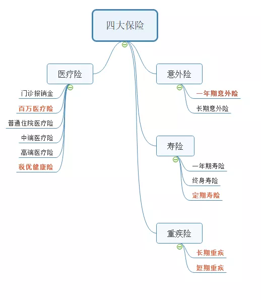
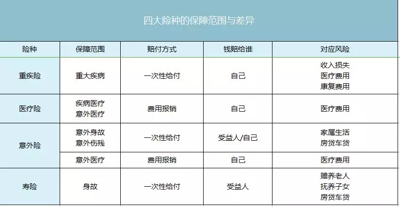
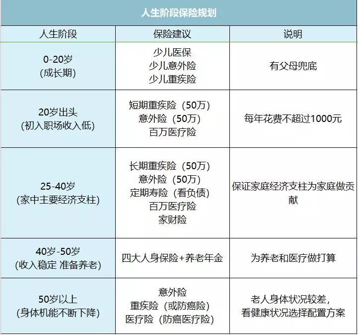
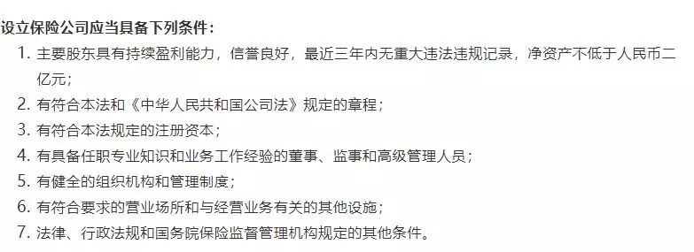
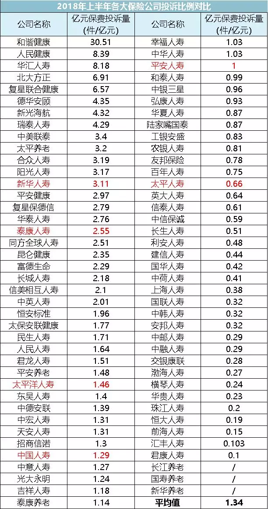
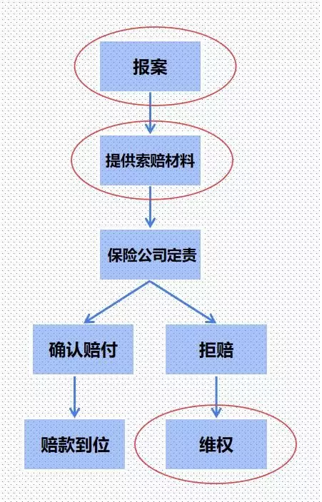

前言：父母年龄大了，想要给他们买一份保险，尤其是医疗和重疾作为保障，因此学习一些保险知识以免入坑，这里也分享出来，供有需要的朋友学习。

学习链接：

1.https://mp.weixin.qq.com/s/af_DWTz--Zsgxi8F1uO7tg

2.https://mp.weixin.qq.com/s?__biz=MzI5NDkyNTg1NA==&mid=2247484324&idx=1&sn=00b791f044872ca18c7d6d84f73f9c6b&chksm=ec5a20d5db2da9c3bef50b0529f38ff60d6744fe2720f75bcaa754dd8409ff676358d1dc7604&scene=21#wechat_redirect

题外话：

1.[社保知识了解一下](https://www.zhihu.com/question/47845109)

2.[社保知识了解一下2](https://www.zhihu.com/question/303929949)

# 保险配置

## [一、保险四大类](https://mp.weixin.qq.com/s?__biz=MzI5NDkyNTg1NA==&mid=2247484337&idx=1&sn=3c5582d7f5d997a2d0fe79937eca3f49&chksm=ec5a20c0db2da9d615d16dc162ebb5d1cc061ff736baa0c18f504823a78c5eb9a054bf7bb4c9&scene=21#wechat_redirect)

### （1）意外险

1.定义：外来的、突发、非本意的非疾病客观事件；

2.类型分为两种：一年期意外险和长期意外险。**对绝大数家庭，买一年期以外就够了**；

3.意外险健康告知特别宽松，生效时间也快，最快第二天，最慢一周就会生效。

4.意外险的保险责任：意外伤残\身故、意外医疗。

 - 意外伤残\身故是给付型
 - 意外医疗是报销型
 
5.**特别提示：**

 - 不买返还型（即储蓄型）
 - 注意特别约定，有些意外险会对坠亡和溺水进行免责或降低保额，需要着重留意。
 - 普通意外险不保国外，出国旅游前买一份旅游意外险很有必要。
 - 意外险价格便宜，杠杆高。成人花100块就能获得50万的保障，所以一般建议把意外险作为第一份保单。需要提醒的一点是，0-9岁的孩子即便意外身故也只赔20万，所以不建议配置太高保额。

### （2）寿险

1.寿险可分为三类：一年期寿险、定期寿险、终身寿险。对于90%以上的家庭来说，最适合买的是定期寿险。

2.定寿的保障期限一般分为10年、20年或者60岁。建议买20年或者60岁的。

3.一般来说，**定期寿险保额=家中贷款（房贷、车贷）+抚养子女所需的钱+赡养父母所需的钱。**

总体来讲定期寿险健康告知非常宽松，常见的乙肝、结节等都可以投保，只要保额不超过 200 万无需体检，购买非常方便。

4.**特别提示：**

 - 1、不买返还型
 - 2、留意免责条款。免责条款里面的内容，那么保险公司是不赔的。买产品时需要留意一下，看自己能否接受条款里的内容。
 
### （3）健康险之重疾险

1.医疗险是报销型，重疾险是给付型

2.重疾险实际是一种 “工作收入损失险”，**买重疾，核心要抓住两点：保额和保障时间。**

 - 优先考虑保额，保额不足很可能在关键时刻起不到作用。**重疾险保额=3-5年的家庭支出+康复、护理费用≈50万**
 - 在保证保额足够的基础上，再去延长保障时间。重疾险的种类有短期重疾（保一年）和长期重疾的区别，长期重疾也有保到60岁、70岁，保终身的选项。
 - 在此基础上，再去考虑保障重疾的数量、含不含轻症、单次或多次赔付这些影响较小的因素。

3.**特别提示：**

 - 不要买返还型
 - 带病体买重疾险限制比较多，稍后会细讲。

### （4）健康险之医疗险

1.医疗险围绕的是就医贵，就医繁，两个难题，采用的都是报销制。

  根据报销的内容不同，医疗险分为“五兄弟”：
  
  - 1、门诊报销金：报销的是平常发烧感冒去看门诊的钱，实际意义不大。
  
  - 2、百万医疗险：  
   > 1）低保费，高保额：对于30岁左右的人，花上300元以下的保费，就能获得百万甚至千万的保额。这正是百万医疗险做的事情。
   
   > 2）大多数产品不保证续保：百万医疗险大多是一年一保，而且不保证续保。所以购买时，优先考虑能续保的。
   
   > 3）大多数产品有免赔额：市面上大多数的百万医疗险都有不同数额的免赔额，多数在1万左右。所谓免费额1万，就是自己需要掏1万块，剩下的部分保险公司才会给你报销。
        一场大病，社保会为你报销60%—70%左右，再加上1万免赔额，事实上总花费超过3万，才能用得上百万医疗险。                                                
        所以别看是几百万保额，都只是数字，大部分是用不上的。
   
  - 3、普通住院医疗险：
  > 前面不是说百万医疗险有免赔额吗？普通住院医疗险负责保障的就是这个部分。   
   低保费、低免赔、低保额，医保赔它赔，医保不赔的它也不赔，算是医保的一个补充。   
   从投保出发点看，重视1万内的医疗费用才会考虑这种低额医疗险。然而，付起这份保费的人，往往都能承担得起这1万的医疗费用。   
   于此同时，遇上大病，这种保险又是杯水车薪。地位很尴尬。
   
  > 这种保险的适用场景比较有限，比如家里有宝宝，这款产品就比较实用。在宝宝时期，非常容易住院，而且大部分都是花费在一两万小病。

  - 4、中端医疗险：
  > 到了这个位置，就讲究看病的体验了。    
    普通医院排队难，挂号难，去私立医院又舍不得，那么就可以买一份中端医疗险。    
    一年万元，低至几千就可以去一些口碑不错的私立医院。

  - 5、高端医疗险：
  > 想去美国日本这些治疗比较先进的国家，高端医疗险全都能满足了。唯一的缺点就是贵，一年几万的保费不是咱们普通人该考虑的。

  - 补充：税优健康险
  > 自带六重光环：可带病投保、无等待期、0免赔额、可报销社保外用药、保证续保、有税收优惠。
  
  > 购买条件是现在还在交个人所得税，保费大概是2400一年，需要联系相应的保险公司购买。大家除非最近遇上了紧急的事件，也不必急着买，后面我会详谈这类产品的。

  

## [二、不同年龄该配置什么保险](https://mp.weixin.qq.com/s?__biz=MzI5NDkyNTg1NA==&mid=2247484445&idx=1&sn=baba9d59a340a8bcce1d02caffa4d6e8&chksm=ec5a276cdb2dae7a49b82394a4fc053ea77c597af7bfa9ced9bd67b29d7e0975a187ea0c52d6&scene=21#wechat_redirect)

买保险，讲究的是在正确的时候做正确的事。

### （1）0-20岁：

1.少儿医保：

很便宜，每年只要花100-500块（国家还会补贴40%-60%），就能报销60%-90%的医疗费用。
无论什么身体状况，新生儿落地就可参保。而且在出生三个月之内参保，这三个月之间产生的医疗费用都报销。

所以无论大人还是小孩，在考虑商业保险以前，一定要把医保这个国家基础福利配上。

2.意外险：一是要重视意外医疗部分，实报实销；二是如果家里的孩子实在太皮，还可以顺道买个附带监护人责任保险。三是学平险，并不建议单独购买，只适合在意外险的基础上做个补充。

3.重疾险：重疾险是收入补偿，所以，少儿重疾其实补偿的是家长为了照顾孩子这几年，造成的收入损失。因而保额也不必太高，30万左右。买一年期的重疾险或者保障20年就成，等他们长大了让他们自己买。

4.医疗险：在买了前几个保险的前提下，医疗险用处基本不大。仅作为补充。

### （2）20岁出头：

1.宗旨：降低预算，提升保额，缩短保障年限，获得保障。

2.这时候买保险，建议按年买，都买短期险。  
  - 1、一年期短期重疾险（50万保额）+一年期意外险（50万保额）+百万医疗险 = 总花费不超过一千
  - 2、如果手头宽裕的话，也可以多花点钱，把短期重疾险换成长期重疾险。这时候身体好，买长期重疾险又便宜，相当划算。

### （3）25-40岁：

1.这时候配保险顺序记住七个字：死、病、医、残、（孩、老、财）  
  前四个是必买的，后面三个可以看情况买。

 - 1、死（定期寿险）
   - 定期寿险保额=家中贷款+抚养子女的钱+赡养父母的钱
   - 保障20年或到60岁。
 - 2、病（重疾险）
   - 重疾险确诊即赔，会在得病之初给患者一笔钱，既缓解了患者的资金压力，也有助于患者康复。
   - 重疾险保额=3-5年的家庭支出+康复、护理费用≈50万
 - 3、医（百万医疗险）
   - 防范极端的医疗风险，覆盖社保不报销的部分。
   - 市面上的绝大多数产品不保证续保，优先建议去购买一款几年内保证续保的百万医疗险，这样几年内的医疗花销就无虞了。
 - 4、残（意外险）
   - 意外险会按照伤残等级按照不同比例赔付，钱不一定能全拿到。而且短期意外险的价格比较便宜，一两百块钱就能买到50万的保额。
   - 建议意外险保额可以买到100万以上。
 - 5、孩
   - 给孩子买保险，参见0-20岁
 - 6、老
   - 给老人买保险，参见50岁以上
 - 7、财
   - 为房子买份家财险。火灾、台风、暴雨等原因造成了房子损害都保，买了图一个安心。
   
### （4）40-50岁：

1.这时候买保险，要分两种情况说：
 - 一是在40岁前，没有配齐四大人身保险的人，配置与25-40岁时类似，不再赘述一遍了。
 > 1、重疾险功能的转化：此时，是重疾险的末班车。年龄再高，就可能出现保费倒挂的现象（交的保费比保额高），还是要上车。
 像百万医疗险这种短期险最大的问题就是续保难，身体出现了变化就不给续了。人到老年身体差，很可能在最需要保险时保险公司不给保了。此时再买长期重疾险，更像是为自己存了一个以小搏大的医疗准备金。一旦触发，就可以拿钱治病。
 
 > 所以，40多岁买重疾险，在预算充足时考虑适当拉长保障年限，保到70岁或保终身。
 
 > 2、定期寿险有没有必要再买：一点要看负债，如果未来的还款主力是自己，那么这个定寿险还是要配的。否则的话，定寿险的保额不必太高。

 - 二是在40岁前，已经配齐四大人身保险的人。
 > 1、审视保额是否足够。需要根据家庭财务状况适当加保。
 
 > 2、审视自己的理财能力是否足够支撑自己养老.如果手头的投资工具有限，也没有投资理财的经验。可以考虑适当配置一些养老年金，作为退休后养老金的补充。
 
 > 养老年金的年化收益不算太高，不超过4%。好在它特别安全，即便承保的保险公司倒了，也会把保单转移到其他保险公司给你兑付。
   
### （5）50岁以上：

1.意外险：

市面上的意外险，多能保到65岁左右，即便超过了这个年龄，也有专门的老年意外险。  
一定优先配上。

2.重疾险\防癌险：

防癌险是一个阉割版的重疾险，患了癌症以后才赔，保额也普遍做不高。
只是它，一来健康告知比较宽松，像三高患者都可以买。二来保障年龄范围比较广，有些保险75岁还能买。三来会比重疾险便宜一点。

3.医疗险\防癌医疗险：

能买医疗险的老年人一定要买上，可以续保就一定要续，能续一秒算一秒。
不过，65岁以前没有得过大病，没有三高、糖尿病等一系列慢性病，的老人实在少见。

所以如果买不了，可以考虑防癌医疗险，只报销癌症的治病费用。和防癌险一样，健康告知也比较宽松。

## [三、小保险公司靠谱吗？](https://mp.weixin.qq.com/s?__biz=MzI5NDkyNTg1NA==&mid=2247484750&idx=1&sn=65d39a77424aade90ec4b5e284081ea3&chksm=ec5a263fdb2daf29fc72e704184b40dea8016c086a89fe2c6d277a1a1e75b78bc01c0d692f85&scene=21#wechat_redirect)

咱们买保险，挑的是保险产品，而不是保险公司。

### （1）所谓的「小公司」到底有多小？

1.江湖上保险公司林立，但是它远比你想象的要少。

> 现在大陆有多少保险公司呢？根据银保监会官网公布的信息，截至2018年12月，在大陆经营的保险公司，保险集团控股公司12家，人身险公司96家，财产险公司89家。但是以大家熟知的「中国平安」为例，它分为：平安人寿、平安健康险、平安养老和平安财险四家子公司。这四家公司各持有一块牌照，也就是说，仅平安一家就持有4块牌照。所以呢，真实数字要比直接加和少一些，在120家左右。而香港，点大的地方，就有一百五六十家保险公司，

> 量少的结果，是这些保险公司的质量真的很高。

2.在这些保险公司中，简单可以分为三大流派：
 - 1）品牌公司，如中国人寿、中国平安、太平洋、新华、泰康等。
 - 2）合资公司，比如瑞泰人寿、中英人寿、工银安盛、中信保诚等等。
 - 3）新兴公司，常听说的比如百年人寿、信美相互、华贵人寿等等

在大陆卖保险是要牌照的。而想拿到牌照非常难。

从严格意义上来说，保险公司只有相对的大小，所有的保险公司都是非常大的公司。

### （2）当我们在选择保险公司时，到底在挑什么？

1.保险重要的四点：
 - 安全：所有保单的安全性都是一样的，只要五星红旗不倒，你的保单指定能赔。
 
 - 理赔：但凡是保险公司，理赔都有个原则，叫不惜赔、不滥赔。
 > 如果**风险明确，符合理赔条款无异议**，那么保险公司完全没必要为了一份保单而丢掉自己的名声，要知道，理赔才是保险公司的口碑源泉。
 
 - 条款：从常理上判断，小保险公司合同里的坑要相对少。**我们购买人也要认真理解条款的意思。** 必要时寻找有良知的专业人士为你排坑。
 
 - 服务：**两个标准：一个是投诉的比例，一个是理赔速度。** 这两条能比较客观的反映一家保险公司服务的好坏。
   - 1）先看投诉的比例，能找到指标有三个：亿元保费投诉量、万张保单投诉量、万人次投诉量。
   
   

   - 2）接下来说理赔速度
   > 所谓的大公司出险更快，就是个伪命题，大家会发现理赔时间上并不存在明显差异。
   
   > 而且理赔速度本身并没有那么意义重大（表示疑问？），现在不少医院在得知患者有保险的情况下，能够做到先手术再付款，大家不必太担心理赔快慢的问题，该赔的钱迟早是你的。

### （3）为了你的保单，你知道银保监会多么努力吗？

1.银保监会对保险公司的监管，是360°无死角的。

2.保险公司在运营时，接受的监管是三方面的：
 - 1、保险资金运用监管：保险资金的运用，也是要受到严格监管的。一般以固定收益类为主，股权等非固定收益为辅；
 - 2、偿付能力监管
 - 3、再保险机制：你买一份保险，背后不只一家保险公司在保护。还有很多「再保险公司」，也就是为保险公司提供保险的公司
 > 「保险保障基金」目前拥有资产一千二百亿人民币，每当有保险公司真的要经营不下去要完蛋了，「保险保障基金」就会出手救一把，让面临破产的保险公司重获新生，然后功成身退，深藏功与名。「保险保障基金」自2008年成立至今，一共出手过三次，第一次是帮了新华保险，第二次是帮了中华保险。后来的事情，新华保险上市，成为「品牌公司」之一，而中华保险，目前是偿付能力最高的保险公司之一。最近一次出手是今年，安邦保险被接管，「保险保障基金」又拉了一把。
 
 > 如果保险公司真破产倒闭了，保单会转移到其他保险公司。保费有资金运用监管，赔付有偿付能力监管。外有再保障制度对接全球金融，内有保险保障基金为国护盘。
 
 > 所以，无论是大公司还是小公司，在同样的监管条件和法律保障的条件下，破产的可能性都是一样的。

### （4）总结：

1、保险公司没有绝对大小，只有相对大小，所有的保险公司都是非常大的公司；

2、大小保险公司之间理赔无差距，条款无高低，服务无优劣；

3、一张保单的安全，跟保险公司大小无关，靠的是中国出色的监管制度。

4、保险公司是面子，保险产品才是里子。 咱买保险买的是保障，产品才是硬道理。
 

## [四、保险理赔](https://mp.weixin.qq.com/s?__biz=MzI5NDkyNTg1NA==&mid=2247484937&idx=1&sn=d1a7336fa09a515a7c7d012519f15a17&chksm=ec5a2578db2dac6e06afad5b7c2ec386de538608ac2ed47d845709b09a43f39ff8029c5b6194&scene=21#wechat_redirect)

### （1）理赔，其实是件轻松事

1.不惜赔、不滥赔

> 根据《保险法》的规定，保险公司收到资料30日内必须要做出是否理赔的决定。
从实际的数字看，保险公司的效率普遍高于这个时间：通常来说，理赔会在三天到一周左右得到处理，
小额理赔最快几个小时到账，大额理赔的时间稍长，3天-30天不等。

### （2）保险公司不赔的真相

1.买保险就是买的那一纸合同。

2.根据江苏保监会的一份资料显示：  
  52%的拒赔是因为被保险人未如实告知既往病史，27%属于条款约定的除外责任，12%属于不符合条款约定的保障范围。
  
3.条款千万条，细读每一条；买时不仔细，赔时两行泪。  
  理赔的前提是如实告知，且符合理赔标准。
  
4.**「理赔不难」，起码要包括四个前提：**
 - 1、保险合同有效：投保时如实告知身体情况，在保险期限以内，每年按时交纳保费、不断档。
 - 2、属于保险责任：生的事故属于保险责任范围，像老太太拿着意外保险的合同赔付重疾肯定是不行的。
 - 3、**不属于责任免除范围**，责任免除范围是保险产品不赔付的范围。
 - 4、保险事故属实：确认不是骗保，不是有意欺诈。
 
### （3）理赔的流程

1.如何报案

 - 出险了就赶紧报案，不要拖，很多保险条款都会规定，出险后 10 日内要报案。
要是多隔个几天再报案啥的，人家保险公司指不定会怀疑你在拖延时间伪造证据呢。

> 1、建议平常做好保单管理工作，不要在用到的时候，才匆忙想起买过什么保险。  
>    尤其是购买过寿险，一定要在在购买后告知保单的指定受益人以及直系亲属（父母、妻子）。

 - 万一真的忘记申请理赔了，也不用担心，《保险法》也有规定，寿险的索赔时效是5年，重疾、医疗、意外是2年。
在这个时间内，都可以向法院提起申诉。

 - 保险公司的报案渠道有很多种，有且不限于：客服电话、官方 APP、官方公众号、线下代理人。
 这几种渠道里，**最建议的还是电话客服报案**，一般拨打客服电话按照语音提示操作，转接到人工客服即可。

- 报案时一般需要提供下列信息以供记录：**出险时间、出险地点、事故经过、就诊信息**。  
  要注意的是，客服电话会有录音，所以应尽量将问题表达清楚，避免可能的纠纷。 

2.需要准备的理赔材料

这部分，是在理赔过程中最容易出现差错的地方。所有的理赔材料可以简单分为三类：

 - 1、基础材料：如理赔申请书、身份证、银行账号、保险合同等，这些都属于现成的，比较好准备。
 - 2、关系证明：如果不是被保险人本人去申请理赔，都要出具关系证明。  
      像重疾险、医疗险这些用于治病的，委托别人申请需要一份经过公证的授权委托书，被保险人自己亲自去申请则不用。      
      如果是寿险这种由于被保险人死亡而需要理赔的，需要一份受益人与被保人的关系证明，如果之前有指定受益人，提供户口本即可；没有指定，还需要到公证处确认合法继承权和继承份额。
> 2、在购买保险时，更建议为保单指定受益人，而不是默认法定受益人。   
     这样的话，办理理赔时的速度更快，需要递交的材料也更少。   
     需要变更保单受益人也很简单，电话联系保险公司或者登陆官网更改即可。

 - 3、第三方出具的报告或证明：这部分**最重要**，关系到是否达到理赔条件。
   - 1）门急诊或住院医疗，最重要的收好发票原件，如果发票原件要交给医保中心，就要医保中心开具一张发票分隔单，并加盖公章。还要保留用药清单、出院小结、检查报告等。
   - 2）重疾/轻症保险金，需要二甲级以上医院出具诊断证明书，同时还有医疗病历、病理组织检查报告。
   - 3）伤残保险金，专业鉴定机构出具残疾程度鉴定书；
   - 4）身故保险金，需提供死亡证明、户籍注销证明。
> 3、去医院看病，每一张纸都要留着。无论是社保还是商业保险，都有可能成为报销或给付的重要凭证。

> 4、买保险后，去医院看病，病历要注意，差几个字，就可能造成赔不赔的差别：  
  1）医生填写病历的时候，拜托医生注意措辞，在没确诊或者不必要的情况下，不要随意在病历本上写下先天的、原生的、多少年前的、旧病复发等相关词语；  
  2）因意外导致的疾病，要请医生在病历卡上写上意外事由，避免被误认为是旧疾。

递交上去材料以后，保险公司会进入审核阶段，对递交的材料责任认定和损失认定。
调查清楚后会正式下发赔付结论：
通常情况下，确定赔付几天内就会打钱。
如果很不幸，发生了拒赔，那么就牵扯到处理纠纷的问题了。

3.发生纠纷该怎么办

即便是发生了拒赔，也不要慌，如果证据完备，重新拿到赔付的可能性还是很大的。拒赔的时候会收到一份拒赔告知书，里面会写明拒赔理由。

如果不服，就要积极地准备证据了：以往的体检报告、病历本、跟相关人员的微信截图、电话录音。有条件的话，可以找专业人士咨询。

**一般来说，维权方式包括三种**：

 - 1、协谈：会有专门的协谈人员与被保人沟通，如果是由于保险销售的误导等原因造成的理赔纠纷，咱们一定要做好相关的取证工作。
   不管是文字证据还是语音证据，如果**证据充分**，是可以让保险公司承担责任的。
 - 2、向银保监会投诉（12378保险消费者投诉维权热线）  
   一般的合同纠纷不会插手，而会建议你起诉。走这条路，要抱着打持久战的准备
 - 3、向法院提起诉讼：两审终审制，且当事人不服一审法院判决的，可以在法定的上诉期内向高一级人民法院上诉申请再审。  
   保险公司都会预留一定比例的资金用于通融赔付，说得直白点，按照程序和合同来讲不应该理赔，但是通过通融赔付，也能拿到部分理赔款。

### （4）关于理赔，还有几点要注意

1、千万不要低估保险公司的调查能力，买保险前一定不能有侥幸心理，试图隐瞒信息。  
  能买就买，不能买别硬买。千万别信别的渠道不保，在我这能保这种鬼话。更千万别低估保险公司的调查能力。
> 5、医保卡千万不要外借，有外借记录要如实告知保险公司，否则在理赔时容易扯皮。

2、千万不要高估保险代理人的业务水平：多学点保险知识，能买的话自己买，自主申请理赔。  
   另外，如果觉得之前自己已经被代理人误导了，趁早联系保险公司进行补充说明。

3、小公司的保险理赔难？不，放心买  
   大公司和小公司的唯一差别在于，大公司的品牌溢价更高，宣发运营成本更高，买到坑货的概率更大。
   
4、互联网买保险不靠谱？不，放心买  
   在线上买，会生成电子保单，在保险公司官网都可以查询验真。  
   而且线上理赔也比较方便，不少保险都开通了一键理赔，报案信息和理赔材料提交以后，审核没问题就直接赔了，有问题保险公司的理赔人员会联系你的。

